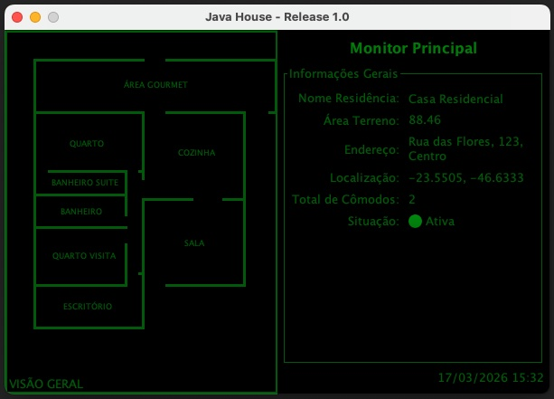
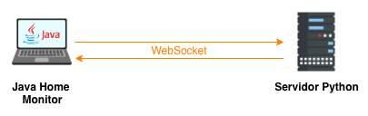

# 🏠 Java Home Monitor
Created by: Jean Santos

> Sistema de monitoramento para casas automatizadas com arquitetura client-server e foco em boas práticas de engenharia de software.

---

## 📌 Visão Geral

<p align="center">
  
</p>

O **Java Home Monitor** é um sistema que permite monitorar, de forma centralizada, uma residência automatizada através de uma representação da planta da casa e seus respectivos cômodos.

A aplicação fornece uma visão completa da casa, incluindo:

* Nome da residência
* Tamanho do terreno
* Endereço
* Situação
* Localidade

Além disso, o sistema permite navegar por cada cômodo individualmente e acompanhar o estado dos sensores em **tempo real**.

---

## 🏗️ Arquitetura

A aplicação segue uma arquitetura distribuída simples:

```
Client (Java)  --->  Server (Python)
```

* **Client (Java)**: responsável pela interface, processamento e comunicação
* **Server (Python)**: responsável por fornecer dados e integração

---

## 🧩 Funcionalidades

### 🏠 Visão Geral da Casa

* Exibição da planta da residência
* Informações estruturais e geográficas

### 🚪 Monitoramento por Cômodo

Cada cômodo pode ser acessado individualmente, permitindo monitoramento detalhado de:

* 💡 Iluminação
* 🔌 Tomadas elétricas
* 🌡️ Temperatura
* 🔒 Segurança

---

## ⚙️ Tecnologias e Requisitos

* Java 21
* Maven
* Python3 (servidor)

---

## 🧠 Conceitos e Padrões Utilizados

O projeto foi desenvolvido com forte foco em fundamentos de engenharia de software e design patterns:

### 🧱 Padrões de Projeto

* **Observer** (com eventos customizados)
* **Singleton**
* **Builder**
* **Factory**

### ⚙️ Arquitetura e Engenharia


<p align="center">
  
</p>

* Injeção de dependência com container próprio (`ContainerManager`)
* DTOs imutáveis
* Separação de camadas:
    * View
    * Processing

### 🌐 Comunicação

* WebSocket assíncrono nativo
* Protocolo de comunicação customizado entre cliente e servidor

### ⚡ Concorrência

* Execução assíncrona para comunicação com o servidor
* Controle de agendamento para collectors

### 📜 Observabilidade

* Implementação customizada de logger
---

## 🚀 Como Executar o Projeto

### 🔧 Pré-requisitos

* Java 21 instalado
* Maven instalado
* Servidor Python rodando

---

### 📦 Compilar o Projeto

```bash
mvn clean package
```

---

### ▶️ Executar o JAR e o server

```bash

cd server && python -m venv .local

pip install -r requirements.txt

python server.py
```
Em seguida execute a aplicação:

```bash
java -jar target/javaHome-1.0.jar
```


---

## 🎯 Objetivo do Projeto

Este projeto foi desenvolvido com foco em:

* Aplicação prática de padrões de projeto
* Construção de infraestrutura própria (DI, Logger, protocolo)
* Estudo de concorrência e comunicação assíncrona
* Simulação de um sistema real de IoT/domótica

---

## 📌 Desafios propostos

Foi deixado os seguintes desafios para qualquer estudando que queira estudar esse projeto.

* Desacomplamento total da interface grafica com a logica de apresentação dos dados nos componentes UI
* Alterar o ApplicationContext para não ser utilizado como contexto estático e sim como um bean injetavel 
* Implementar os métodos do protocolo UPDATE e DROP, para realizar ações permanentes no servidor, como acender a luz e apagar e mudar o nivel de intensidade do brilho.
* Alterar o servidor python para gerar cenarios simulados mais reais, com dados proximos da realidade.
* Adicionar uma camada de seguranca no trafego da rede do websocket

---
## 📄 Licença

Este projeto é destinado para fins educacionais e de estudo.
